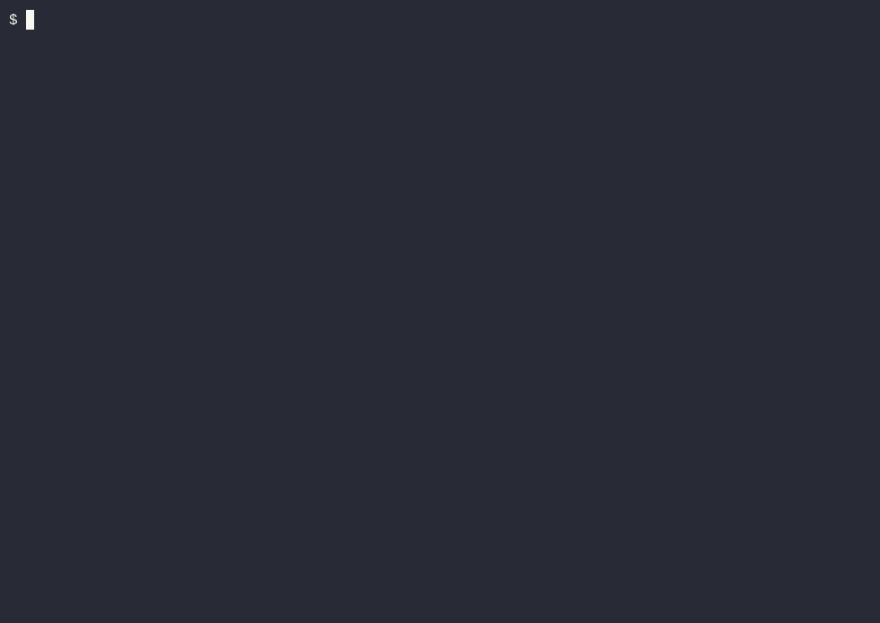

# kvcdn-cli

Releasable command-line tool for KV-cache generation, verification, quantization, and hosted sharing for LLMs.

## Why this project exists

Large language models spend most of their inference time on the *prefill* phase: processing every token of a long document before generating the first new token. In retrieval-augmented generation, chat, and agent workflows, the same long context is reused across many queries. Re-computing its KV cache for every request wastes GPU time, increases latency, and raises cost.

kvcdn makes that work reusable. It lets you:

- **Generate** a KV cache from a long document once.
- **Verify** that loading the cache and continuing from it is token-exact compared to a full prefill.
- **Quantize** caches to reduce storage and bandwidth without breaking exact continuation.
- **Share** caches privately or publicly through a hosted KVCDN endpoint, so downstream inference services can skip prefill entirely.

In short, kvcdn turns the long-context prefill problem into a cache-and-serve problem. A practical application is an inference service that lets clients supply a KVCDN artifact reference; the service fetches and loads the prefill cache dynamically, then runs continuation generation against the cached context without repeating the expensive prefill.

## Install

Download the release binary for Linux x86-64 from the [latest release page](https://github.com/kvcachestore/kvcdn-cli/releases/latest):

```bash
curl -L -o kvcdn \
  https://github.com/kvcachestore/kvcdn-cli/releases/latest/download/kvcdn-x86_64-unknown-linux-gnu
chmod +x kvcdn
sudo mv kvcdn /usr/local/bin/kvcdn
kvcdn --help
```

To build from source instead, see the [Build](#build) section.

## Local-only usage

No authentication is required for local generation, verification, quantization, or benchmarking.



## Commands

- `kvcdn verify` — verify that loading a saved KV cache produces token-exact output.
- `kvcdn diag` — logits-level diagnostic comparing scratch vs. KV-cache paths.
- `kvcdn benchmark` — measure prefill vs. continuation speedup.
- `kvcdn plot` — summarize benchmark results.
- `kvcdn quant` — quantize a KV artifact and optionally run token-exact verification.
- `kvcdn search` — find saved KV artifacts by longest token-prefix match.
- `kvcdn login` — authenticate with the hosted service via OIDC.
- `kvcdn logout` — remove stored OIDC tokens and API key.
- `kvcdn api-key` — manage the stored KVCDN API key.
- `kvcdn upload` — upload a KV artifact to your hosted KVCDN endpoint.
- `kvcdn list` — list remote KV artifacts in a project.
- `kvcdn download` — download a remote KV artifact by ID.
- `kvcdn delete` — delete a remote KV artifact by ID.
- `kvcdn whoami` — show the current user and active org/project.

## File extension convention

kvcdn uses `.kv` as the file extension for KV cache artifacts (for example, `context.kv`, `model.kv`, or `context.q8.kv` after quantization). The CLI's default output paths, upload/download examples, and hosted workflows all follow this convention.

If you provide an explicit `--kv-path`, `--output`, or `--input` path that does not end in `.kv`, the CLI automatically appends `.kv` and prints a warning so the convention is enforced.

## Hosted usage

Run `kvcdn login` to authenticate. Use `kvcdn api-key set <key>` to store an API key for non-interactive uploads. Use `kvcdn upload <artifact.kv> --name <name>` to store caches in your hosted KVCDN endpoint. Artifacts are private by default; pass `--visibility public` to make an artifact fetchable without authentication.


Common hosted workflows:

```bash
# Upload an artifact
kvcdn upload context.q8.kv --name context

# List artifacts
kvcdn list
kvcdn list --format json

# Download an artifact
kvcdn download <artifact-id> --output context.q8.kv

# Delete an artifact
kvcdn delete <artifact-id> --yes

# Run inference against an uploaded artifact (skips local download/prefill)
curl -X POST "https://$API_HOST/api/v1/orgs/$ORG/projects/$PROJECT/artifacts/$ARTIFACT_ID/infer" \
  -H "Authorization: Bearer $(kvcdn whoami --format json | jq -r .access_token)" \
  -H "Content-Type: application/json" \
  -d '{"question": "What is the main point?", "n": 32}'
```

The inference response contains the generated token IDs:

```json
{"artifact_id": "...", "tokens": [123, 456, ...], "token_count": 32}
```

The backend spawns the local `kvcdn` inference engine; set `KVCDN_BINARY_PATH` if the binary is not on the backend's `PATH`. The CLI reads backend and OIDC settings from `~/.config/kvcdn/config.toml` (or `KVCDN_*` environment variables) so that `kvcdn login`, `kvcdn upload`, and `kvcdn delete` can reach your deployed backend. The backend operator provides the `api_url` and `issuer_url` values; fill in the placeholders below with the values they give you:

```toml
api_url = "https://<your-api-host>"
issuer_url = "https://<your-issuer>"
client_id = "kvcdn-cli"
default_org = "acme"
default_project = "acme"
```

Artifacts are scoped to the project of the API key (or login session) you authenticate with; the hosted API routes (`/api/v1/artifacts`) do not take org/project path segments. The `--org` and `--project` flags are still accepted for backwards compatibility but no longer affect routing.

Run `kvcdn login` to authenticate interactively, or store an org-scoped API key with `kvcdn api-key set <key>` for non-interactive use.

## Model support

`--model` accepts any Hugging Face model identifier. The loader inspects the model's `config.json` `architectures` field and dispatches to a matching adapter. Downloaded checkpoints are stored in the standard Hugging Face cache location: `HF_HUB_CACHE` if set, otherwise `$HF_HOME/hub`, otherwise `~/.cache/huggingface/hub`.

### Example model for first-time users

`Qwen/Qwen3-0.6B` is the recommended starting model. It is small enough to run on CPU,
supports the Qwen3 architecture, and is permissively licensed for research and
non-commercial use. Most examples in this README use it as the default:

```bash
kvcdn verify --model Qwen/Qwen3-0.6B --context-file context.txt
```

Replace the model identifier with any supported architecture once you are ready
to move to larger checkpoints.

Currently supported architectures:

- `LlamaForCausalLM` (and Llama-3.1/3.2 fine-tunes)
- `MistralForCausalLM` / `MixtralForCausalLM`
- `YiForCausalLM`
- `Qwen2ForCausalLM`
- `Qwen3ForCausalLM`
- `Phi3ForCausalLM`
- `GemmaForCausalLM` (and Gemma 2 fine-tunes)

Implemented but not yet validated end-to-end:

- `DeepseekV2ForCausalLM` / `DeepseekV3ForCausalLM` — wired and passes reference/cache verify; the MLA compressed-KV cache is too sensitive to the current per-tensor symmetric int8 quantizer to pass quantized verify.
- `Gemma3ForCausalLM` — wired; official checkpoints are gated on Hugging Face and require `HF_TOKEN` for validation.

Known unsupported families (open an issue on GitHub to request them):

- GLM / ChatGLM
- Kimi / Moonshot / Moonlight
- Mamba / RWKV / state-space models
- Nemotron
- GPT-NeoX / GPT-2 / Bloom

Adding a new family only requires implementing the `CausalLM` trait in `src/models/` and registering it in `src/models/registry.rs`.

## Example usage

Verify that a saved KV cache produces token-exact output:

```bash
kvcdn verify --kv-path context.kv \
             --context-file context.txt \
             --question "What is the main point?"
```

Benchmark full-prefill cost against one resident-KV continuation step and write a CSV:

```bash
kvcdn benchmark --lengths 128,256,512 --reps 10 --output bench.csv
kvcdn plot --csv-path bench.csv --model Qwen/Qwen3-0.6B --out amortized-cost.png --max-n 500
```

`plot` produces an 840x600 PNG with log-log axes showing the break-even reuse count. Use `--out` to set the PNG path and `--max-n` to change the reuse-count range (default 1000). The default filename is timestamped under the data directory.

Quantize a KV artifact with a target dequantization dtype and verify continuation accuracy:

```bash
kvcdn quant --context-file context.txt --question "What is the main point?" \
            --target-dtype F32 --verify
```

Search saved KV artifacts for the one whose prompt tokens share the longest prefix with a new query:

```bash
kvcdn search --model Qwen/Qwen3-0.6B \
             --dir ~/.local/share/kvcdn/verify \
             --query "What is the main point?"
```

Generate multiple greedy continuation candidates from the matched prefix (the shared prefix is decoded once, so the forks are nearly free):

```bash
kvcdn search --model Qwen/Qwen3-0.6B \
             --dir ~/.local/share/kvcdn/verify \
             --query "What is the main point?" \
             --tree 4 --tree-tokens 32
```

`--dtype` is an alias for `--target-dtype`. Supported target dtypes are `F32`, `F16`, `BF16`, `FP8` (F8E4M3), and `I8`. The artifact always stores symmetric int8 values as `U8`; `I8` means the dequantizer will produce a standard int8-quantized artifact, while float targets dequantize to the requested float dtype. `U8`, `I4`, `U4`, `FP4`, and `FP1` are not supported because the artifact stores symmetric int8 values (U8) and Candle 0.10 does not implement `to_dtype` for FP4/FP1.

Each successful `kvcdn quant` run writes a machine-readable event sidecar next to the output artifact (`<output>.quant-event.json`) containing the input/output paths, dtype, compression ratio, `max_quant_error`, and verification result.

## Build

```bash
# Local debug build
cargo build

# Local release build
cargo build --release

# Reproducible containerized release build (exports to ./dist/)
./scripts/build-release.sh
```

The Dagger pipeline runs Rust and backend lint/test checks in parallel, then
builds and strips an x86-64 Linux binary
(`dist/kvcdn-x86_64-unknown-linux-gnu`), generates an SPDX SBOM
(`dist/kvcdn-x86_64-unknown-linux-gnu.sbom.json`), and scans the binary with
Trivy. If `COSIGN_PRIVATE_KEY` is provided, it also produces a cosign signature
(`dist/kvcdn-x86_64-unknown-linux-gnu.sig`).

### Runtime requirements

The released Linux binary is built on `debian:bookworm` (glibc 2.36+) and links
dynamically against a few system libraries. It should run on most recent
Debian, Ubuntu, Fedora, and other glibc-based distributions. Before running it,
you can check that the required shared libraries are present:

```bash
ldd kvcdn-x86_64-unknown-linux-gnu
```

Typical dynamic dependencies include:

- `libc.so.6`
- `libssl.so.3` and `libcrypto.so.3`
- `libz.so.1`
- `libstdc++.so.6`, `libgcc_s.so.1`, `libm.so.6`

If your system ships OpenSSL 1.x instead of OpenSSL 3.x, or an older glibc, the
binary will fail to start. In that case, build from source (`cargo build --release`)
or run the Dagger pipeline on a host whose libraries match your target
environment.

### Release build

Build and export the release binary locally using the Dagger module:

```bash
./scripts/build-release.sh
```

Or invoke Dagger directly:

```bash
# Release without signing
dagger call -m dagger release --src=. export --path=./dist

# Release with cosign signing
dagger call -m dagger release --src=. --cosign-key=env:COSIGN_PRIVATE_KEY export --path=./dist
```

The release binary and supporting artifacts are written to `./dist/`:

- `kvcdn-x86_64-unknown-linux-gnu` — stripped Linux x86-64 release binary
- `kvcdn-x86_64-unknown-linux-gnu.sbom.json` — SPDX SBOM
- `kvcdn-x86_64-unknown-linux-gnu.sig` — binary cosign signature (when `COSIGN_PRIVATE_KEY` is set)
- `kvcdn-x86_64-unknown-linux-gnu.sbom.json.sig` — SBOM cosign signature (when `COSIGN_PRIVATE_KEY` is set)

## Limits

The backend is designed around presigned S3 URLs and stateless metadata:

- **Artifact size:** limited by your S3 provider's maximum object size and the
  presigned URL expiration (5 minutes). R2 supports objects up to >5 TiB.
- **Metadata:** stored as a small JSON sidecar (`.meta.json`) next to each artifact
  in the bucket. There is no database to back up.
- **Retention:** objects live in your bucket until you delete them via `kvcdn delete`.
- **Concurrent uploads:** each upload is independent; the backend does not throttle.
- **Authentication:** every API call requires a valid OIDC access token or an
  org-scoped `kv_`-prefixed API key derived from `KVCDN_API_KEY_SEED`.
- **Artifact isolation:** each artifact is stored under a per-customer prefix in
  the bucket. One customer cannot list, download, or delete another customer's
  artifacts, even if they know the artifact ID.

---

## Telemetry

kvcdn collects minimal, anonymous telemetry about command usage. Each hosted command sends one event containing the command name, CLI version, duration, and whether the command succeeded. No prompts, model weights, file contents, or personally identifiable information are included.

Telemetry is **opt-out**: it is sent whenever `KVCDN_API_URL` is configured, unless you disable it:

```bash
export KVCDN_TELEMETRY=0
```

Events are delivered to the configured backend (`/api/v1/telemetry`), which may forward them to a telemetry service using `KVCDN_TELEMETRY_URL` and `KVCDN_TELEMETRY_SECRET`. The CLI waits up to 150 ms for delivery and never blocks command output on telemetry.

*Built by the folks at [**Vibe Coding Agency**](https://vibecodingagency.com/) — we accelerate AI roadmaps with strategy, engineering, operations, generative AI, and board governance. From agentic infrastructure to production RAG pipelines, we ship what works.*

## License

This project is licensed under the [kvcdn-cli Source-Available License](LICENSE).

You may use, copy, modify, and distribute the Software for any lawful purpose,
including commercial use. The only restriction is that you may not operate the
Software, or a derivative work, as a hosted or managed KV-cache storage, sharing,
or serving service that competes with the KVCache Store hosted service. See the
full license text for details.
